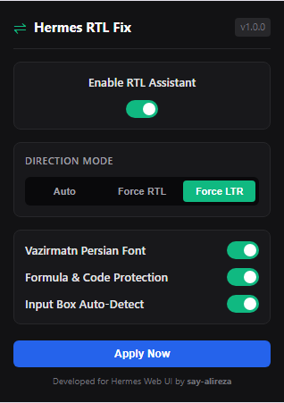

# Hermes Web UI RTL & Math Fix

A specialized Chrome Extension and Userscript that resolves Right-to-Left (RTL) text rendering, bidirectional (BiDi) mixed Persian/English issues, and KaTeX mathematical formula reversal in **Hermes Web UI** (Hermes Studio) and other AI chat interfaces.

<p align="center">
  
</p>

---

## The Problem

When using Persian or Arabic in Hermes Web UI:
1. **Bidirectional (BiDi) Text Distortion:** Persian text mixed with English words, technical terms, and punctuation flips or displays out of order.
2. **Reversed Mathematical Formulas:** Inline and display LaTeX/KaTeX formulas (such as $A \to a \alpha$ or fractions) get reversed or inverted when placed inside RTL containers because math tokens are rendered in reverse visual order without strict isolation.
3. **Misaligned Code & Monospace Blocks:** Backticks, punctuation, and code blocks (`pre`, `code`) get broken or right-aligned.
4. **Input Box Cursor Issues:** The prompt input textarea defaults to LTR, causing cursor jumps and reverse typing when entering Persian.
5. **Lack of Persian Typography:** System fallback fonts for Persian often look jagged and hard to read.

---

## Solutions & Features

- **Smart Paragraph BiDi Detection:** Uses the Unicode Bidirectional Algorithm's first-strong-character rule to automatically apply RTL only to paragraphs, headers, and list items containing Persian/Arabic, keeping pure English blocks intact.
- **Strict KaTeX & Formula BiDi Isolation:** Enforces `direction: ltr !important; unicode-bidi: isolate !important;` on `.katex`, `.katex-display`, and LaTeX containers so operators, exponents, fractions, and symbols never reverse.
- **Code Block Protection:** Keeps `<pre>`, `<code>`, `.hljs-code-block`, and Monaco Editor instances strictly LTR and left-aligned.
- **Input Field Auto-Switching:** Automatically detects Persian in the chat input textarea and aligns cursor and direction to RTL in real time.
- **Persian Typography (Vazirmatn):** Injects the clean, readable Vazirmatn font with comfortable line-height (`1.85`).
- **Real-Time Streaming Support:** An efficient, debounced `MutationObserver` ensures streaming AI responses are styled without flickering or lag.
- **Sleek Floating Widget & Popup:** Toggle between `Auto`, `Force RTL`, and `Force LTR` or disable on demand.

---

## Installation

### Method 1: Load as Chrome / Brave / Edge Extension (Recommended)

1. Clone or download this repository:
   ```bash
   git clone https://github.com/say-alireza/hermes-webui-rtl.git
   ```
2. Open your browser and navigate to:
   - Chrome: `chrome://extensions/`
   - Brave: `brave://extensions/`
   - Edge: `edge://extensions/`
3. Enable **Developer mode** (toggle in the top-right corner).
4. Click **Load unpacked** and select the `hermes-webui-rtl` directory.
5. Open Hermes Web UI (`http://localhost:8648` or your configured host). The extension will automatically activate.

### Method 2: Tampermonkey / Violentmonkey Userscript

If you prefer a userscript:
1. Install [Tampermonkey](https://www.tampermonkey.net/) in your browser.
2. Click **Create a new script** in Tampermonkey.
3. Copy and paste the contents of `userscript/hermes-webui-rtl.user.js`.
4. Save (`Ctrl + S`). It will run automatically on `localhost`, `127.0.0.1`, and `hermes-studio.ai`.

---

## Project Structure

```text
hermes-webui-rtl/
├── assets/
│   └── popup-screenshot.png   # Extension UI screenshot
├── manifest.json              # Chrome Extension Manifest V3 configuration
├── content/
│   ├── content.js             # BiDi detector, DOM processor & MutationObserver
│   └── content.css            # RTL typography, KaTeX isolation & widget styling
├── popup/
│   ├── popup.html             # Extension settings popup UI
│   ├── popup.css              # Dark theme styling for popup
│   └── popup.js               # Settings sync & active tab dispatcher
├── icons/                     # Extension icons (16px, 48px, 128px)
├── userscript/
│   └── hermes-webui-rtl.user.js # Standalone Tampermonkey userscript
├── LICENSE                    # MIT License
└── README.md                  # Documentation
```

---

## License

MIT © [Alireza Rahimpanah](https://github.com/say-alireza)
